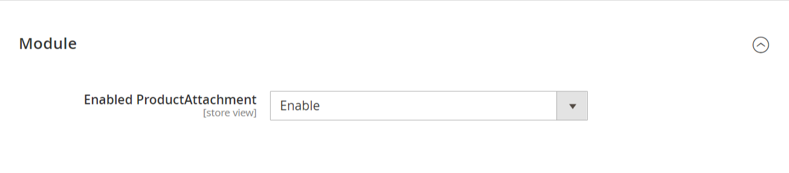
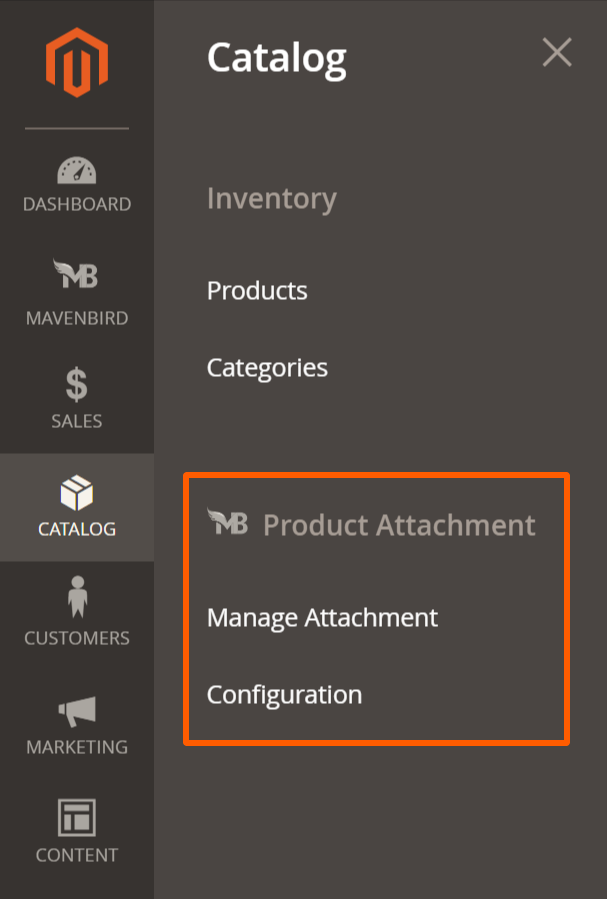
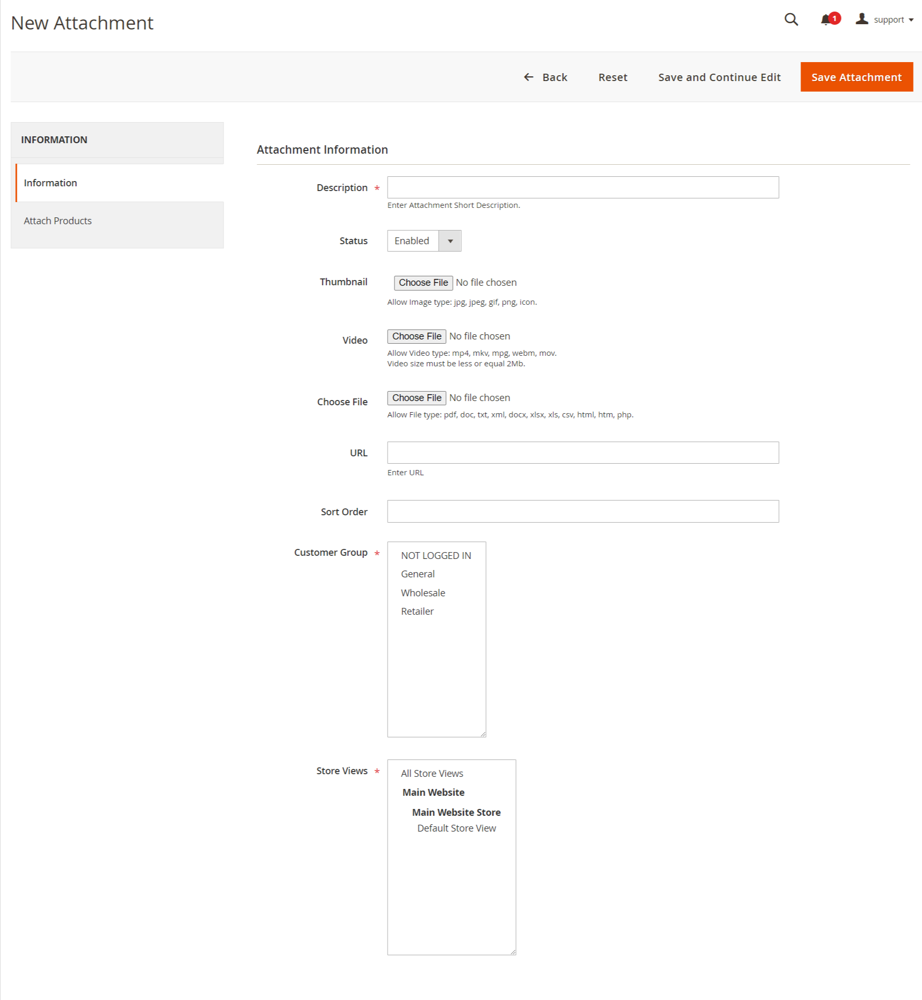

# Magento 2 Product Attachment Extension

Enhance your Magento 2 store with the ability to attach files to products effortlessly. Our Magento 2 Product Attachment Extension simplifies the process of managing product attachments, benefiting both merchants and customers.

## Key Features:

- **Attach Files to Products:**
Easily attach files to products, enhancing product information for customers.
- **Downloadable Files:**
Provide downloadable files directly on product pages for customer convenience.
- **Batch Processing:**
Support for batch attachment of files to multiple products simultaneously.
- **Error Handling:**
Detailed error reporting for troubleshooting attachment issues.
- **File Management:**
Efficiently manage and update attached files as product information changes.

## Benefits:

- **Enhanced Product Information:**
Provide comprehensive product information with downloadable attachments.
- **Customer Convenience:**
Enable customers to access relevant documents directly from product pages.
- **Efficient Management:**
Streamline attachment management across your product catalog.
- **Flexible Configuration:**
Customize attachment options to suit your store's specific requirements.

## Compatibility:
This extension is compatible with Magento 2.4.X (PHP - 8.1 - 8.3) version.

## Installation:
**Install via composer (recommend)** - 

Easy installation process with step-by-step instructions provided for hassle-free setup.
~~~~~~~~~~~~~~~~~~~~~
composer require mavenbird/module-productattachment
php bin/magento setup:upgrade
php bin/magento setup:static-content:deploy
php bin/magento setup:di:compile
php bin/magento cache:flush
~~~~~~~~~~~~~~~~~~~~~

## Upgrade/Update Module:
Run the following command in Magento 2 root folder for easy update -
~~~~~~~~~~~~~~~~~~~~~
composer update mavenbird/module-productattachment
php bin/magento setup:upgrade
php bin/magento setup:static-content:deploy
php bin/magento setup:di:compile
php bin/magento cache:flush
~~~~~~~~~~~~~~~~~~~~~

## Customization Options:

Tailor the attachment process to match your store's specific requirements with customizable options for file management and error handling.

*Configure at Your Ease*

## Support:
Dedicated support team available to assist with installation, customization, and any other queries or concerns.
*[support@mavenbird.com](mailto:support@mavenbird.com)*

## Get Started:
Enhance your product information with our Magento 2 Product Attachment Extension. Simplify attachment management, improve customer experience, and streamline your workflows today!

*Thank you!*